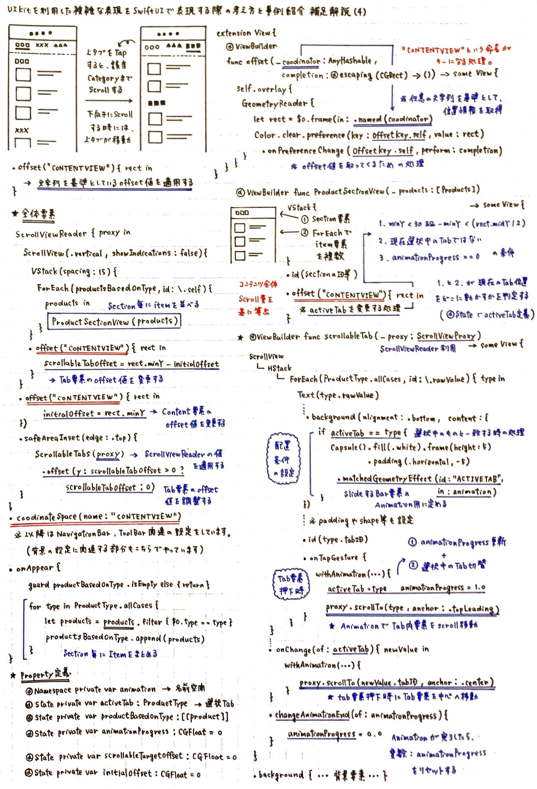
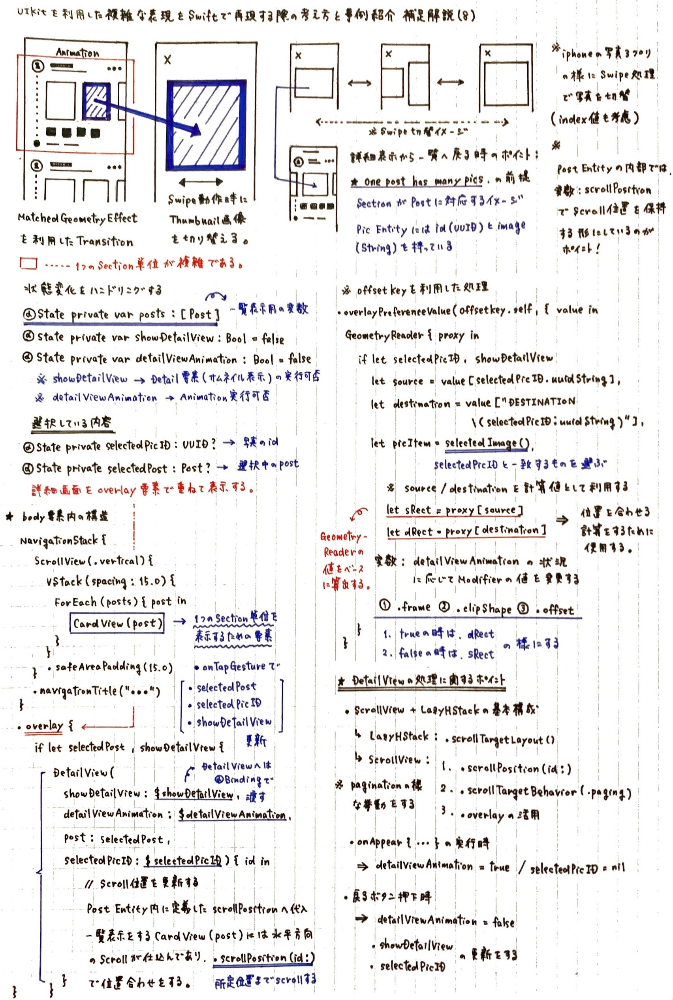

## UIKitを利用した複雑な表現をSwiftUIで再現する際の考え方と事例紹介

<p align="right">
<strong>酒井文也 (Fumiya Sakai) Twitter &amp; github: @fumiyasac</strong>
</p>

<hr>

### はじめに

皆様が日常生活の中で頻繁に利用しているアプリや、平素の業務や個人開発時における機能やUI実装に関するアイデアを得る目的も含めて活用しているアプリの中には、 __特徴的なUI表現が素敵に感じるので思わず利用したくなる__ ・ __機能と体験が調和した形のUI実装が特徴的で自分のアプリにも取り入れたくなる__ という気持ちにさせてくれる物もきっと沢山あるはずです。例えば、スワイプやドラッグ等の様な指の動きに合わせた変化量や画面要素内のスクロール処理を連動する、 __機能性と触り心地と連動したささやかな遊び心__ も兼ね備えたUI実装に関しては、UIKitでの実装がメインであった当時から、様々な創意工夫の余地があり、容易に利用可能なOSSも沢山生まれてきた経緯があったと思います。

昨今では、SwiftUIに備わった機能も大幅に増え、これまではSwiftUIだけでは実現が難しく、UIKitを利用する必要があった様な複雑な実装も徐々に実現可能になりつつあるので、SwiftUIでのUI実装を実現する機会はこれまで以上に加速すると同時に、複雑なUI実装に対しても積極的にアプローチできる可能性を感じています。

本稿では、SwiftUIを活用した複雑なUI実装を考える場合や参考にしたい実装を紐解く場合において、押さえておきたいポイントを下記の様なトピックにフォーカスしてお伝えできればと思います。

1. ScrollViewの変化量を利用した複雑な表現事例
2. DragGesture時に取得できる変化量と連動した動きを応用した表現事例
3. GeometryReaderから取得できる値を有効活用して実現するUI実装事例
4. ScrollViewReaderで提供されている機能を利用したUI実装事例

対象の読者としましては __従来のUIKitで実現していた様な複雑な実装をSwiftUIで実現する際のポイントを知りたい方__ や __SwiftUIを有効活用したUI実装のイメージをより掴みたい方__ 等を想定しております。今回はコード解説よりも図解を用いたアイデア紹介が中心になりますが、ほんの少しでも皆様のご参考になる事ができれば嬉しく思います。

### 1. ScrollViewから取得できる値をUI実装に有効活用する

現状、SwiftUIで提供されているScrollViewではスクロール変化量を取得する事ができないので、独自に下記の様なExtension等を定義し、配置しているView要素内の処理で活用する方針を取る場面は多いと思います。（※WWDC24の発表にもあった通り、iOS18ではScrollViewに対して様々な改善が加えられていましたので、今まで以上に表現の引き出しが増えそうに感じています。）

```swift
// ----------
// 📝 配置したTab要素に対して座標位置を取得するためのExtension定義
// ----------

extension View {

    // MARK: - Function

    @ViewBuilder
    func getRectangleView(completion: @escaping (CGRect) -> ()) -> some View {

        // .overlay表示用Modifier内の処理でOffset値を取得できる形にする
        self.overlay {
            // GeometryReader内部にはColorを定義してScrollView内に配置する要素には極力影響を及ぼさない様にする
            GeometryReader { proxy in
                let rectangle = proxy.frame(in: .scrollView(axis: .horizontal))
                // 👉 OffsetPreferenceKey定義とGeometryProxyから取得できる値を紐づける事でこの値変化を監視対象に設定する
                Color.clear
                    .preference(key: OffsetPreferenceKey.self, value: rectangle)
                    .onPreferenceChange(OffsetPreferenceKey.self, perform: completion)
            }
        }
    }
}

// 👉 補足: この様な形で独自の座標系を定義し、表示画面に定義した`@State`の値を更新する際に有効活用する
// let rectangle = proxy.frame(in: .named("独自の名前"))

fileprivate struct OffsetPreferenceKey: PreferenceKey {

    // MARK: - Property

    static var defaultValue: CGFloat = .zero
    static func reduce(value: inout CGFloat, nextValue: () -> CGFloat) {}
}
```

特にiOS17以降では、様々な表現に応用可能な便利なModifierも追加されているので、これらも上手に活用する場面も増えるかと思います。

- __`.scrollTargetLayout()`__
- __`.scrollPosition(id:anchor:)`__
- __`.scrollTargetBehavior(_:)`__

### 2. これまではUIKit利用時でも難しかった処理をSwiftUIに置き換える際のイメージ例


次ページ以降では、複雑なUI実装をSwiftUIのみで実現する際に、全体的な概要や取得した値を上手に活用してUI表現に関連する処理を組み立てていく際に、重要なポイントになり得る部分をオムニバス形式でまとめた物になります。

- __1ページ目：__ UIKit利用時でも難しい応用的な表現をSwiftUI利用時でも実現することを考える際にポイントになり得る点を書き出したイメージ図解
- __2ページ目：__ matchedGeometryEffectやDragGesture等を応用した表現やScrollViewの状態変化を利用した処理に関するイメージ図解

__【本稿の電子版はこちら💁】__
  - https://github.com/fumiyasac/iosdc2023_pamphlet_manuscript_vol2/blob/main/manuscript.md

※ 紙面の都合上、ノートに記載しているのは6/19時点までの調査内容を掲載しておりますが、今後も継続して、サンプル実装を紐解いたり試していく過程の中で、自分が気になったUI実装に関連する内容についてはノートの内容を拡充していく予定です。


<br>


### 3. iOSDC Japan 2024のパンフレット原稿に掲載できなかったサンプル実装を紐解いた際のまとめノート

私が不定期に取り組んでいる活動の1つとして、YouTube等の動画コンテンツで提供されているコーディング解説で、気になったUI実装サンプルのコードを紐解いた記録を個人的にまとめています。その中で、本稿で紹介した内容より更に応用的なUI実装をしているサンプルを紐解いて、大まかなメカニズムをまとめたものを何点かご紹介致します。

__【補足解説Vol.1🗒️】__


__【補足解説Vol.2🗒️】__


__【補足解説Vol.3🗒️】__


__【補足解説Vol.4🗒️】__



__【補足解説Vol.5🗒️】__


__【補足解説Vol.6🗒️】__


__【補足解説Vol.7🗒️】__


__【補足解説Vol.8🗒️】__


